# Hearten Horticulture Booking System

A local gardening business called Hearten Horticulture requires a booking a system

The project should be able to function as a portal for customers to book sessions without coming into conflict with other customer's booking sessions. The system should be able to tell customers when the company is free to work on their garden while keeping their user data anonymous for others to see.


## UX
A local business requires an app for their customers to book gardening sessions.

### Colour Scheme

The site features the following colours:

Forest Green Traditional: #134611;
India Green: #3E8914;
Green Pigment: #3DA35D;
Light Green: #96E072;
Nyanza: #E8FCCF;
The colours were selected for their often associated use within the gardening industry with the exception of Nyanza, an off-green/yellow which will be used for contrast.


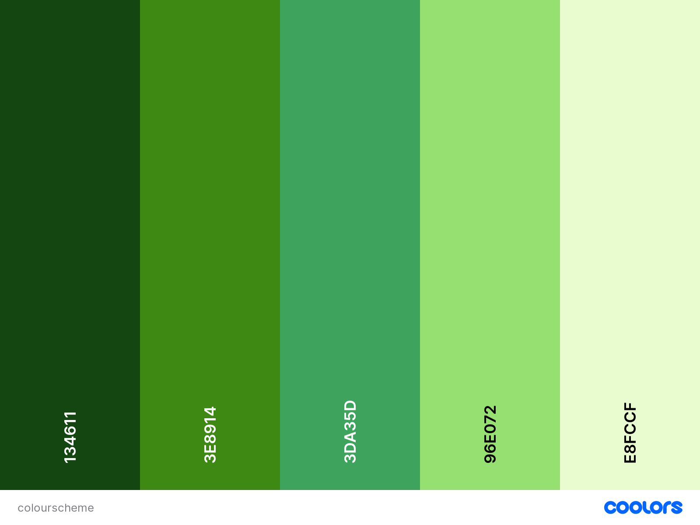  


### Typography

- [Barlow Condensed](https://fonts.google.com/specimen/Barlow+Condensed) was used for the primary headers and titles.

- [Font Awesome](https://fontawesome.com) icons were used throughout the site, such as the social media icons in the footer.

Most of the website will use some variation of barlow condensed styled in various ways, such as italic and bold. They will be weighted between 300 and 500. The fallback font will be sans-serif.

## User Stories

### Site owner goals
- Give customers a portal in which to book sessions for garden maintence
- Give the company a way to plan availablity for other projects that aren't garden maintenance.

### Customer Goals
As a user:
- Immeditately know who this site is for
- Simple navigation and with booking feedback.
- View the site on mobile so I can book in customer sessions myself in person for elderly customers with no IT experience.

As a logged in customer :
- I need to be able to book sessions, even block book for a few hours.
- I want to be able to see sessions I have booked in the past and have been carried out.

As a admin for the business, I want to :
- I want to see which sessions users are booking in.
- Let customers know when I'm not available.
- Edit and delete sessions.
- Edit/delete customers we no longer work with.
- See all sessions booked.

## Wireframes
To follow best practice, wireframes were developed for mobile, tablet, and desktop sizes.
I've used [Balsamiq](https://balsamiq.com/wireframes) to design my site wireframes.


<details>
<summary> Home Page Wireframes</summary>

| Size | Screenshot |
| --- | --- |
| Desktop | 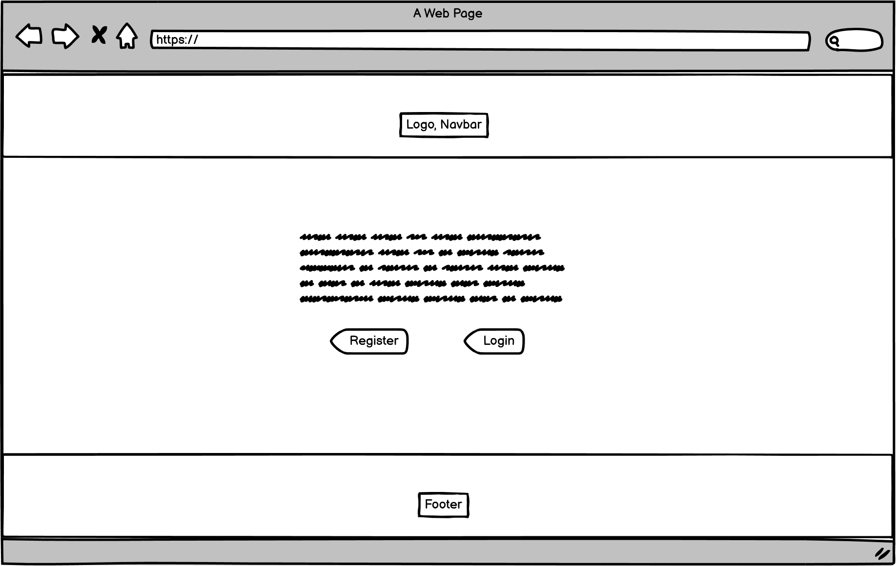 |
| Mobile | 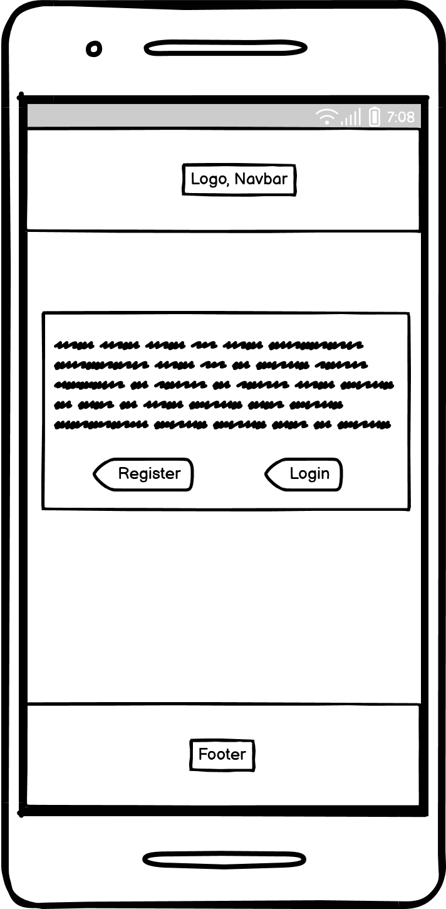 |

<br>
</details>

<details>
<summary>Registration Page Wireframes</summary>

| Size | Screenshot |
| --- | --- |
| Desktop | 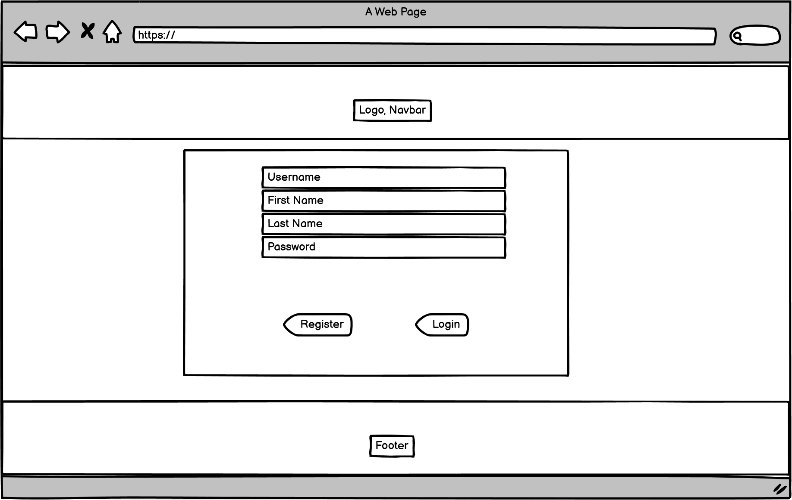 |
| Mobile | 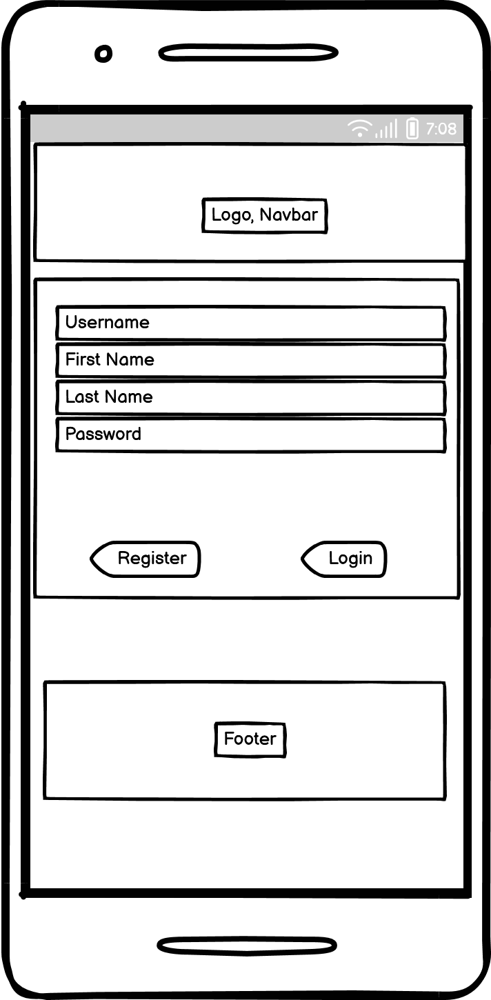 |

<br>
</details>

<details>
<summary>Login Page Wireframes</summary>

| Size | Screenshot |
| --- | --- |
| Desktop | 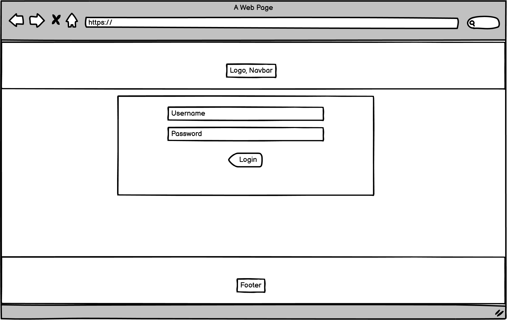 |
| Mobile | 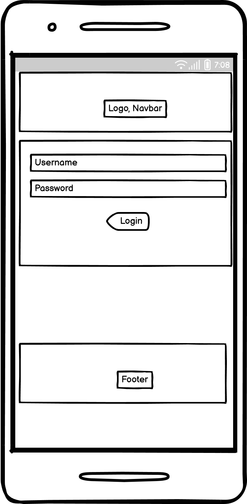 |

<br>
</details>

<details>
<summary>Customer Booking Page Wireframes</summary>

| Size | Screenshot |
| --- | --- |
| Desktop | 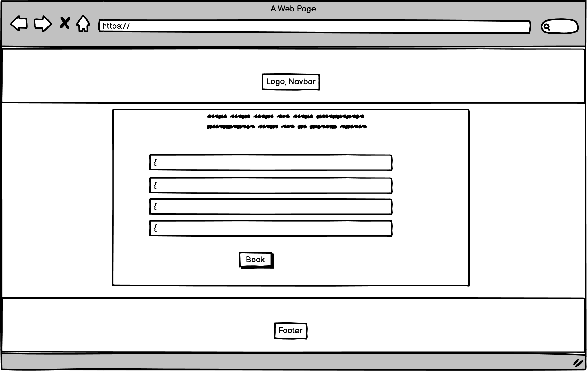 |
| Mobile | 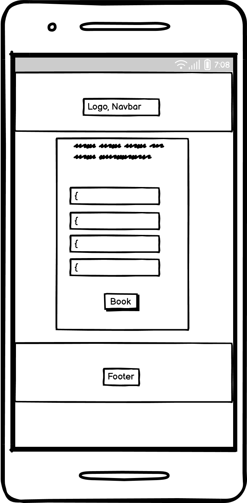 |

<br>
</details>

<details>
<summary>Adminstration Session Tracking Page Wireframes</summary>

| Size | Screenshot |
| --- | --- |
| Desktop | 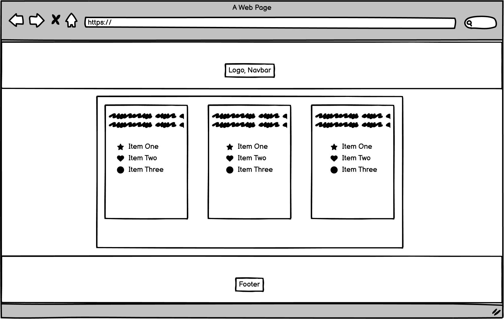 |
| Mobile | 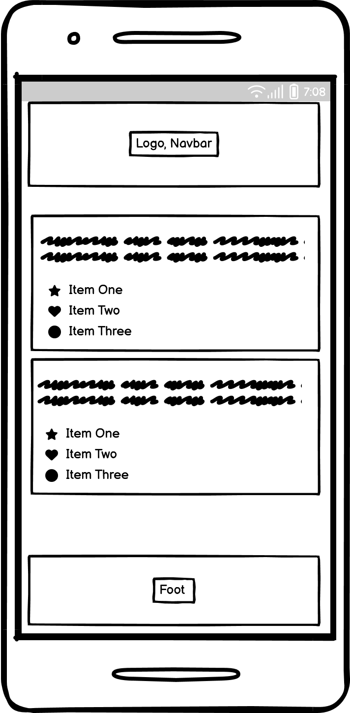 |

<br>
</details>

<details>
<summary>Customer Session Management Page Wireframes</summary>

| Size | Screenshot |
| --- | --- |
| Desktop | 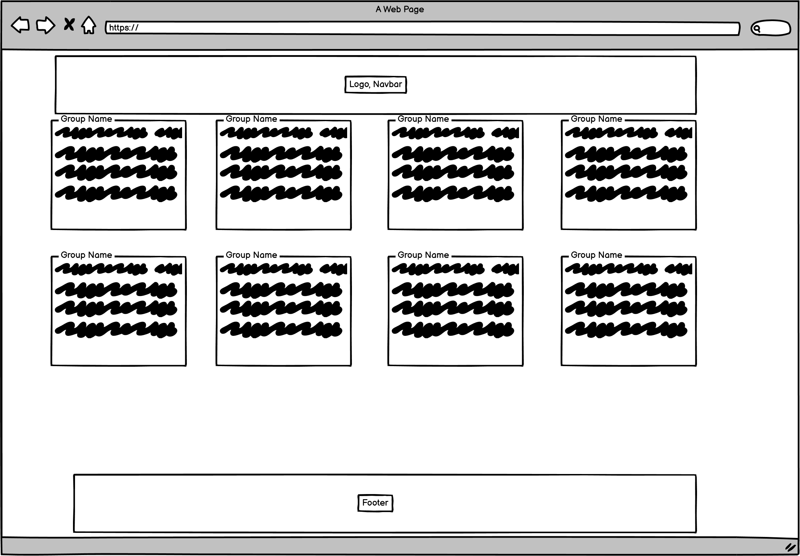 |
| Mobile | 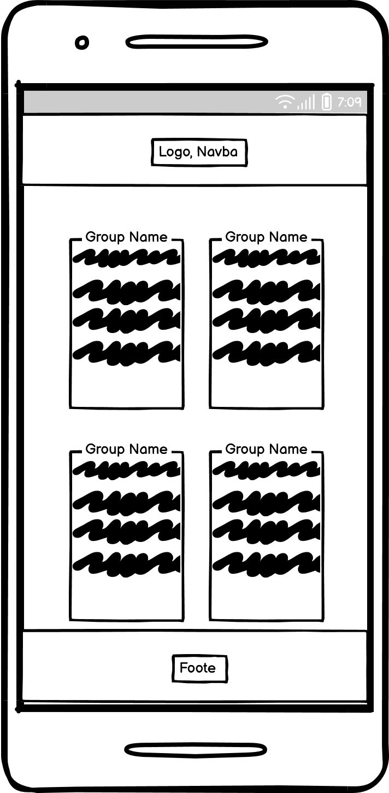 |

<br>
</details>

## Testing

For all testing, please refer to the [TESTING.md](TESTING.md) file.

## Deployment

### MongoDB Non-Relational Database

This project uses [MongoDB](https://www.mongodb.com) for the Non-Relational Database.

To obtain your own MongoDB Database URI, sign-up on their site, then follow these steps:
- The name of the database on MongoDB should be called **insert-your-database-name-here**.
- The collection(s) needed for this database should be **insert-your-collection-names-here**.
- Click on the **Cluster** name created for the project.
- Click on the **Connect** button.
- Click **Connect Your Application**.
- Copy the connection string, and replace `password` with your own password (also remove the angle-brackets).

### Heroku Deployment

This project uses [Heroku](https://www.heroku.com), a platform as a service (PaaS) that enables developers to build, run, and operate applications entirely in the cloud.

Deployment steps are as follows, after account setup:

- Select **New** in the top-right corner of your Heroku Dashboard, and select **Create new app** from the dropdown menu.
- Your app name must be unique, and then choose a region closest to you (EU or USA), and finally, select **Create App**.
- From the new app **Settings**, click **Reveal Config Vars**, and set your environment variables.

| Key | Value |
| --- | --- |
| `DATABASE_URL` | user's own value |
| `IP` | 0.0.0.0 |
| `MONGO_DBNAME` | user's own value |
| `MONGO_URI` | user's own value |
| `PORT` | 5000 |
| `SECRET_KEY` | user's own value |

Heroku needs two additional files in order to deploy properly.
- requirements.txt
- Procfile

You can install this project's **requirements** (where applicable) using:
- `pip3 install -r requirements.txt`

If you have your own packages that have been installed, then the requirements file needs updated using:
- `pip3 freeze --local > requirements.txt`

The **Procfile** can be created with the following command:
- `echo web: python app.py > Procfile`
- *replace **app.py** with the name of your primary Flask app name; the one at the root-level*

For Heroku deployment, follow these steps to connect your own GitHub repository to the newly created app:

Either:
- Select **Automatic Deployment** from the Heroku app.

Or:
- In the Terminal/CLI, connect to Heroku using this command: `heroku login -i`
- Set the remote for Heroku: `heroku git:remote -a app_name` (replace *app_name* with your app name)
- After performing the standard Git `add`, `commit`, and `push` to GitHub, you can now type:
	- `git push heroku main`

The project should now be connected and deployed to Heroku!

### Local Deployment

This project can be cloned or forked in order to make a local copy on your own system.

For either method, you will need to install any applicable packages found within the *requirements.txt* file.
- `pip3 install -r requirements.txt`.

If you are using SQLAlchemy for your project, you need to create a local PostgreSQL database.
In this example, the example database name is **db-name**.

```shell
workspace (branch) $ set_pg
workspace (branch) $ psql

... connection to postgres ...

postgres=# CREATE DATABASE db-name;
CREATE DATABASE
postgres=# \c db-name;
You are now connected to database "db-name" as user "foobar".
db-name=# \q
```

Once that database is created, you must migrate the database changes from your models.py file.
This example uses **app-name** for the name of the primary Flask application.

```shell
workspace (branch) $ python3

... connection to Python CLI ...

>>> from app-name import db
>>> db.create_all()
>>> exit()
```

To confirm that the database table(s) have been created, you can use the following:

```shell
workspace (branch) $ psql -d db-name

... connection to postgres ...

postgres=# \dt

	List of relations
Schema | Name | Type | Owner
-------+------+------+--------
public | blah1 | table | foobar
public | blah2 | table | foobar
public | blah3 | table | foobar

db-name=# \q
```

You will need to create a new file called `env.py` at the root-level,
and include the same environment variables listed above from the Heroku deployment steps, plus a few extras.

Sample `env.py` file:

```python
import os

os.environ.setdefault("IP", "0.0.0.0")
os.environ.setdefault("MONGO_DBNAME", "user's own value")
os.environ.setdefault("MONGO_URI", "user's own value")
os.environ.setdefault("PORT", "5000")
os.environ.setdefault("SECRET_KEY", "user's own value")

# local environment only (do not include these in production/deployment!)
os.environ.setdefault("DB_URL", "user's own value")
os.environ.setdefault("DEBUG", "True")
os.environ.setdefault("DEVELOPMENT", "True")
```

If using Flask-Migrate, make sure to include the following steps as well.

During the course of development, it became necessary to update the PostgreSQL data models.
In order to do this, [Flask-Migrate](https://flask-migrate.readthedocs.io) was used.

- `pip3 install Flask-Migrate`
- Import the newly installed package on your main `__init__.py` file:
	- `from flask_migrate import Migrate`
- Define **Migrate** in the same file after **app** and **db** are defined:
	- `migrate = Migrate(app, db)`
- Initiate the migration changes in the terminal:

```shell
workspace (branch) $ flask db init

	... generating migrations ...

workspace (branch) $ set_pg
workspace (branch) $ flask db migrate -m "Add a commit message for this migration"

	... migrating changes ...

workspace (branch) $ flask db upgrade

	... updating database ...
```

#### Cloning

You can clone the repository by following these steps:

1. Go to the [GitHub repository](https://github.com/rhysbobbett/gardenmaintenance) 
2. Locate the Code button above the list of files and click it 
3. Select if you prefer to clone using HTTPS, SSH, or GitHub CLI and click the copy button to copy the URL to your clipboard
4. Open Git shell or Terminal
5. Change the current working directory to the one where you want the cloned directory
6. In your IDE Terminal, type the following command to clone my repository:
	- `git clone https://github.com/rhysbobbett/gardenmaintenance.git`
7. Press Enter to create your local clone.

Alternatively, if using Gitpod, you can click below to create your own workspace using this repository.

[](https://gitpod.io/#https://github.com/rhysbobbett/gardenmaintenance)

Please note that in order to directly open the project in Gitpod, you need to have the browser extension installed.
A tutorial on how to do that can be found [here](https://www.gitpod.io/docs/configure/user-settings/browser-extension).

#### Forking

By forking the GitHub Repository, we make a copy of the original repository on our GitHub account to view and/or make changes without affecting the original owner's repository.
You can fork this repository by using the following steps:

1. Log in to GitHub and locate the [GitHub Repository](https://github.com/rhysbobbett/gardenmaintenance)
2. At the top of the Repository (not top of page) just above the "Settings" Button on the menu, locate the "Fork" Button.
3. Once clicked, you should now have a copy of the original repository in your own GitHub account!


## Credits

I used the slack channels I am a part of to solve various error messages I received with my heroku deployment. 


### Content

| Source | Location | Notes |
| --- | --- | --- |
| [Markdown Builder](https://traveltimn.github.io/markdown-builder) | README and TESTING | tool to help generate the Markdown files |
| [Chris Beams](https://chris.beams.io/posts/git-commit) | version control | "How to Write a Git Commit Message" |
| [W3Schools](https://www.w3schools.com/howto/howto_js_topnav_responsive.asp) | entire site | responsive HTML/CSS/JS navbar |
| [Materialize CSS](https://materializecss.com/) | entire site | CSS framework


### Media

I own the company logo used on the site. No other media is featured to keep the site as clean as possible.

### Acknowledgements

- I would like to thank the [Code Institute](https://codeinstitute.net) tutor team for their assistance with troubleshooting and debugging some project issues.
- I would like to thank the [Code Institute Slack community](https://code-institute-room.slack.com) for the moral support; it kept me going during periods of self doubt and imposter syndrome.
- I would like to thank my partner Catherine, for all the cups of tea made to keep me going!
