# Testing

Return back to the [README.md](README.md) file.

I have carried out testing and have summarised many new features to implement in future versions of this booking system. 
I believe the site works to a minimal viable standard, potentially I would like to utilise it in a real world scenario for a business to test it further.
I discovered not all features work as intended, but are viable for basic use in demonstrating the read write functionality of the site. MongoDB makes it easily scalable.
Users will be able achieve minimal functionality with the site, but it would be helpful in a real-world scenario.

## Code Validation

I have validated all html pages and code in the repository, the results are seen below.
The W3 validator gave me some error messages such as unopen or unclosed tags, which I can firmly establish are caused by my Flask setup and block structures on the html pages.
I had an aria-label misuse error for a sidenav that I believe relates to the use of Materialize for my base page's layout.

### HTML

I have used the recommended [HTML W3C Validator](https://validator.w3.org) to validate all of my HTML files.

| Page | W3C URL | Screenshot | Notes |
| --- | --- | --- | --- |
| base.html | [W3C](https://validator.w3.org/nu/?doc=https%3A%2F%2Fhhbookingmanager-bf4877fa0fd9.herokuapp.com%2F) |  |  |
| admin.html | [W3C](https://validator.w3.org) | 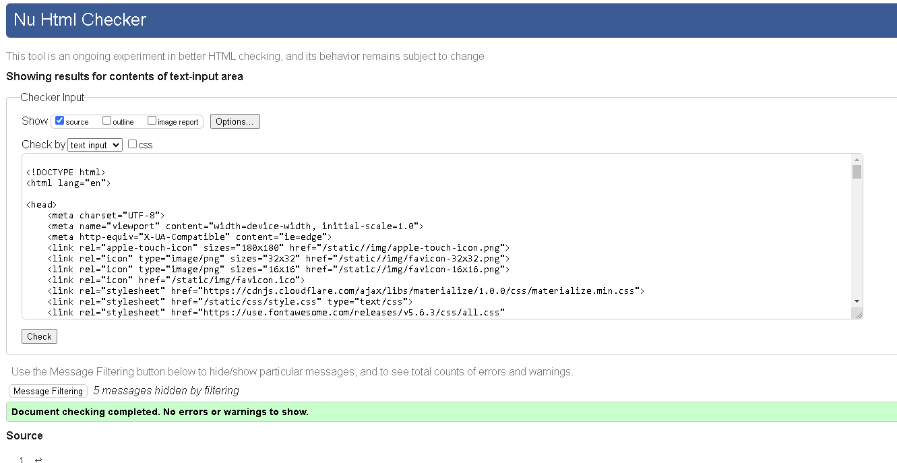 |  |
| my_appointments.html | [W3C](https://validator.w3.org) |  |  |
| error404.html | [W3C](https://validator.w3.org) |  |  |
| holidays.html | [W3C](https://validator.w3.org) |  |  |
| homepage.html | [W3C](https://validator.w3.org) |  |  |
| login.html | [W3C](https://validator.w3.org) |  |  |
| logout.html | [W3C](https://validator.w3.org) |  |  |
| my_appointments.html | [W3C](https://validator.w3.org) | 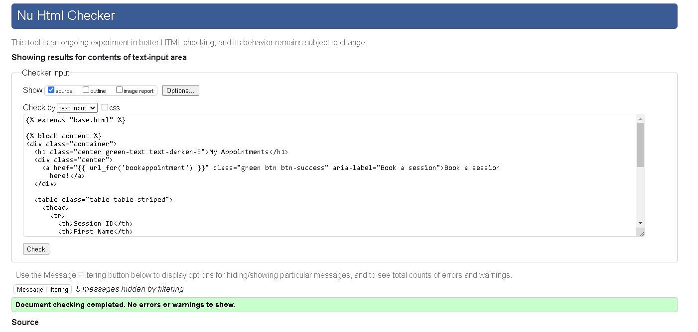 |  |
| register.html | [W3C](https://validator.w3.org) | 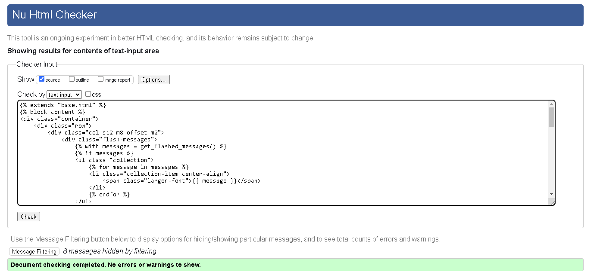 |  |

⚠️⚠️⚠️⚠️⚠️ START OF NOTES (to be deleted) ⚠️⚠️⚠️⚠️⚠️

**IMPORTANT**: Python/Jinja syntax in HTML

Python projects that use Jinja syntax, such as ``, ``, and `{{ variable|filter }}`
will not validate properly if you're copying/pasting into the HTML validator.

In order to properly validate these types of files, it's recommended to
[validate by uri](https://validator.w3.org/#validate_by_uri) from the deployed Heroku pages.

Unfortunately, pages that require a user to be logged-in and authenticated (CRUD functionality),
will not work using this method, due to the fact that the HTML Validator (W3C) doesn't have
access to login to your pages.
In order to properly validate HTML pages with Jinja syntax for authenticated pages, follow these steps:

- Navigate to the deployed pages which require authentication
- Right-click anywhere on the page, and select **View Page Source** (usually `CTRL+U` or `⌘+U` on Mac).
- This will display the entire "compiled" code, without any Jinja syntax.
- Copy everything, and use the [validate by input](https://validator.w3.org/#validate_by_input) method.
- Repeat this process for every page that requires a user to be logged-in/authenticated.

🛑🛑🛑🛑🛑 END OF NOTES (to be deleted) 🛑🛑🛑🛑🛑

### CSS

I have used the recommended [CSS Jigsaw Validator](https://jigsaw.w3.org/css-validator) to validate all of my CSS files.

⚠️⚠️⚠️⚠️⚠️ START OF NOTES (to be deleted) ⚠️⚠️⚠️⚠️⚠️

- If you are copying/pasting your HTML code, use this link: https://jigsaw.w3.org/css-validator/#validate_by_input
- (*recommended*) If you are using the live deployed site, use this link: https://jigsaw.w3.org/css-validator/#validate_by_uri

It's recommended to validate the live site if you only have a single CSS file using the deployed URL.
This will give you a custom URL as well, which you can use on your testing documentation.
It makes it easier to return back to the page to validate it again in the future.
The URL will look something like this:

- https://jigsaw.w3.org/css-validator/validator?uri=https%3A%2F%2Fhhbookingmanager-bf4877fa0fd9.herokuapp.com%2F&profile=css3svg&usermedium=all&warning=1&vextwarning=&lang=en#errors

| File | Jigsaw URL | Screenshot | Notes |
| --- | --- | --- | --- |
| style.css | [Jigsaw](https://jigsaw.w3.org/css-validator/validator?uri=https%3A%2F%2Fhhbookingmanager-bf4877fa0fd9.herokuapp.com%2F&profile=css3svg&usermedium=all&warning=1&vextwarning=&lang=en#errors) | 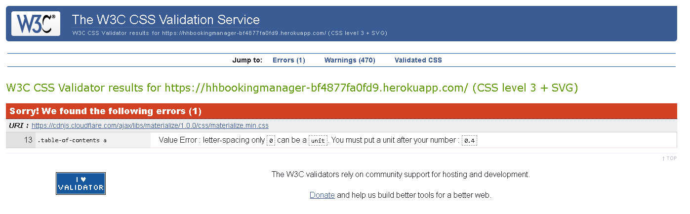 | Pass: 1 error due to Materialize Framework, not an issue |

### Python

I have used the recommended [PEP8 CI Python Linter](https://pep8ci.herokuapp.com) to validate all of my Python files.

| File | CI URL | Screenshot | Notes |
| --- | --- | --- | --- |
| run.py | [PEP8 CI](https://pep8ci.herokuapp.com/https://raw.githubusercontent.com/rhysbobbett/hhbookingmanager/main/run.py) | 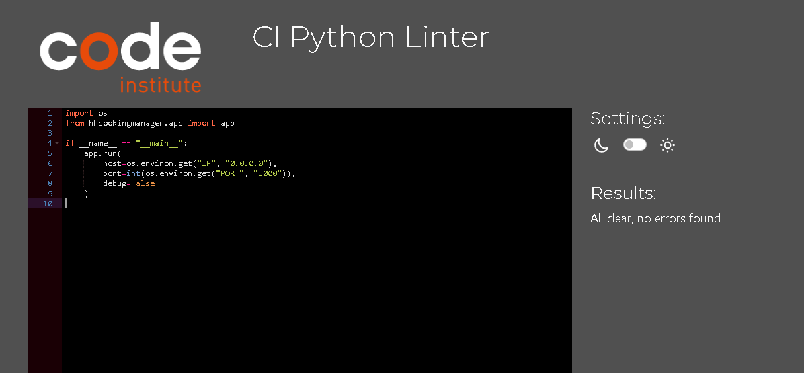 | no errors |
| run.py | |  | no errors |

## Browser Compatibility

⚠️⚠️⚠️⚠️⚠️ START OF NOTES (to be deleted) ⚠️⚠️⚠️⚠️⚠️

Use this space to discuss testing the live/deployed site on various browsers.

Consider testing at least 3 different browsers, if available on your system.

Recommended browsers to consider:
- [Chrome](https://www.google.com/chrome)
- [Firefox (Developer Edition)](https://www.mozilla.org/firefox/developer)
- [Edge](https://www.microsoft.com/edge)
- [Safari](https://support.apple.com/downloads/safari)
- [Brave](https://brave.com/download)
- [Opera](https://www.opera.com/download)

**IMPORTANT**: You must provide screenshots of the tested browsers, to "prove" that you've actually tested them.

Please note, there are services out there that can test multiple browser compatibilities at the same time.
Some of these are paid services, but some are free.
If you use these, you must provide a link to the source used for attribution, and multiple screenshots of the results.

Sample browser testing documentation:

🛑🛑🛑🛑🛑 END OF NOTES (to be deleted) 🛑🛑🛑🛑🛑

I've tested my deployed project on multiple browsers to check for compatibility issues.

| Browser | Screenshot | Notes |
| --- | --- | --- |
| Chrome | 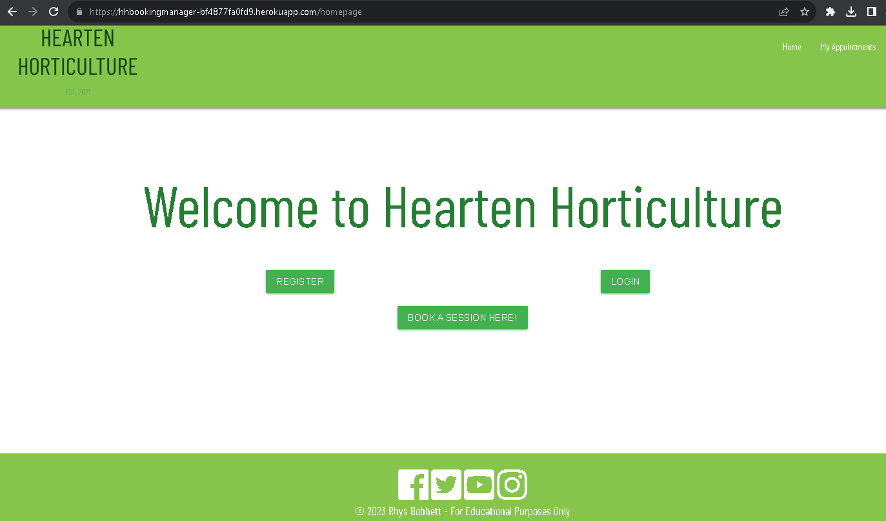 | Works as expected |
| Firefox | 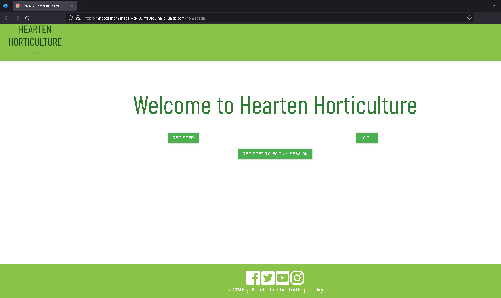 | Works as expected |
| Edge |  | Works as expected |
| Safari |  | Minor CSS differences |
| Brave |  | Works as expected |
| Opera |  | Minor differences |
| Internet Explorer |  | Does not work as expected |
| x | x | repeat for any other tested browsers |

## Responsiveness

⚠️⚠️⚠️⚠️⚠️ START OF NOTES (to be deleted) ⚠️⚠️⚠️⚠️⚠️

Use this space to discuss testing the live/deployed site on various device sizes.

The minimum requirement is for the following 3 tests:
- Mobile
- Tablet
- Desktop

**IMPORTANT**: You must provide screenshots of the tested responsiveness, to "prove" that you've actually tested them.

Using the "amiresponsive" mockup image (or similar) does not suffice the requirements.
Consider using some of the built-in device sizes in the Developer Tools.

If you have tested the project on your actual mobile phone or tablet, consider also including screenshots of these as well.
It showcases a higher level of manual tests, and can be seen as a positive inclusion!

Sample responsiveness testing documentation:

🛑🛑🛑🛑🛑 END OF NOTES (to be deleted) 🛑🛑🛑🛑🛑

I've tested my deployed project on multiple devices to check for responsiveness issues.

| Device | Screenshot | Notes |
| --- | --- | --- |
| Mobile (DevTools) |  | Works as expected |
| Tablet (DevTools) |  | Works as expected |
| Desktop |  | Works as expected |
| Google Pixel 7 Pro |  | Works as expected |
| iPhone 12 |  | Works as expected |

IPhone 12 Pro

 

| Device | Page | Screenshot|
| ----------- | ----------- |---------------- |
| IPhone 12 Pro| Homepage | |
| | Log In | &check; |
| | Register | &check; |
| | Administration | &check; |
| | Book Appointments | &check; |
| | Holidays | &check; |
| | Edit Users | &check; |
| | 404 Page | &check; |
| | 500 Page | &check; |

IPhone 12 Pro

 

| Device | Page | Screenshot|
| ----------- | ----------- |---------------- |
| Samsung Galaxy Note 3| Homepage | |
| | Log In | &check; |
| | Register | &check; |
| | Administration | &check; |
| | Book Appointments | &check; |
| | Holidays | &check; |
| | Edit Users | &check; |
| | 404 Page | &check; |
| | 500 Page | &check; |

## Lighthouse Audit

I've tested my deployed project using the Lighthouse Audit tool to check for any major issues.

| Page | Size | Screenshot | Notes |
| --- | --- | --- | --- |
| Base.html | Mobile | 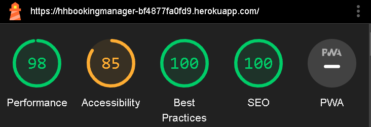 ||
| Base.html | Desktop | 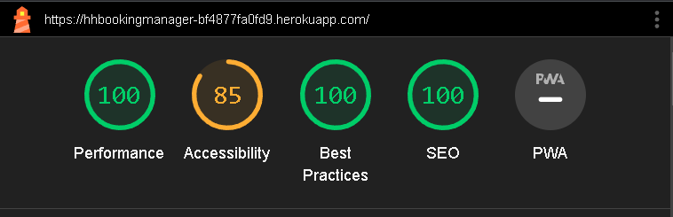 | |
| homepage.html | Mobile | 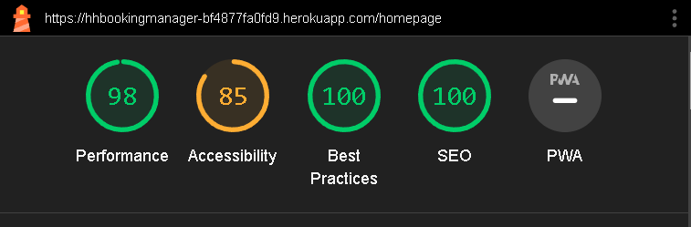 ||
| homepage.html | Desktop | 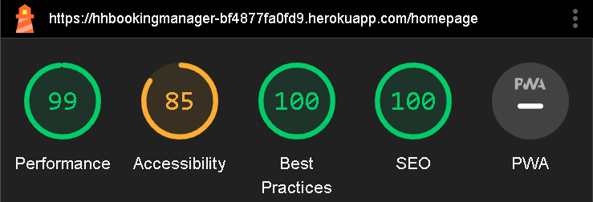 ||
| admin.html | Mobile | 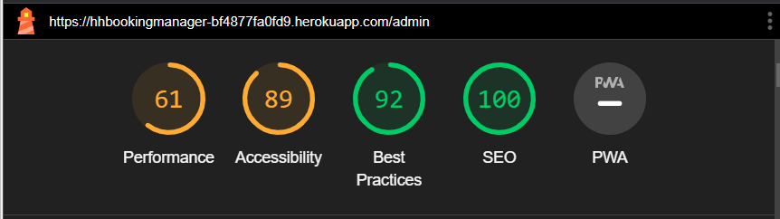 | |
| admin.html | Desktop | 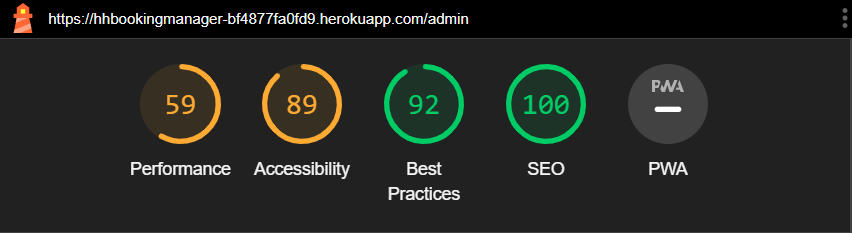 ||
| my_appointments.html | Mobile | 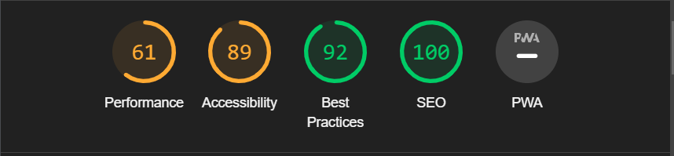 | |
| my_appointments.html | Desktop | 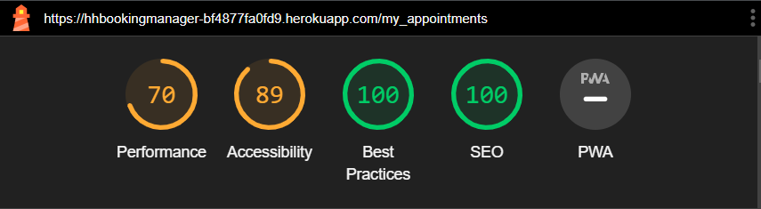 ||
| bookappointment.html | Mobile | 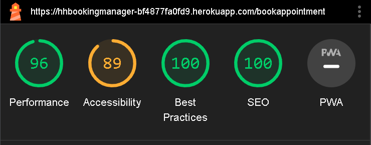 | |
| bookappointment.html | Desktop | 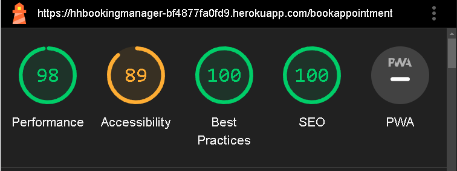 ||

## Defensive Programming

Forms:
- Users cannot submit to an empty form in appointments
- Passwords must contain capital letters and at least 1 special character.

Flask/Django:
- Users cannot brute-force a URL to navigate to a restricted page such as admin.html.
- Users cannot perform CRUD functionality while logged-out
- User-A should not be able to manipulate data belonging to User-B, or vice versa
- Non-Authenticated users should not be able to access pages that require authentication
- Standard users should not be able to access pages intended for superusers.
All stated criteria has been met for Flask defensive programming. A captcha would be useful
in preventing multiple signing up and scripting against the website, a potential for a ddos style attack.

## User Story Testing

🛑🛑🛑🛑🛑 END OF NOTES (to be deleted) 🛑🛑🛑🛑🛑

| User Story | Screenshot | Notes |
| --- | --- | --- |
| As a new site user, I would like to immeditately know who this site is for, so I know I'm on the right website. |  | The landing page has a welcome span with buttons for direct access to the main features of the site. |
| As a new site user, I want simplicity and to use straight forward navigation, so that I can access what I require quickly. |  | The nav is clear and adapts depending on user or admin, the navbar collapses on mobile with the same links available.
| As a new site user, I would like to book sessions easily. | 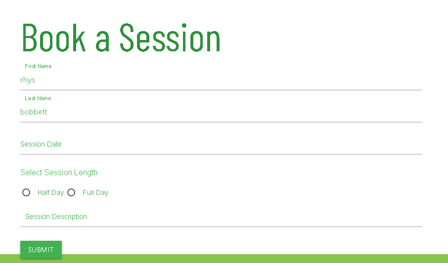 |
| As a returning site user, I would like to ____________, so that I can ____________. | 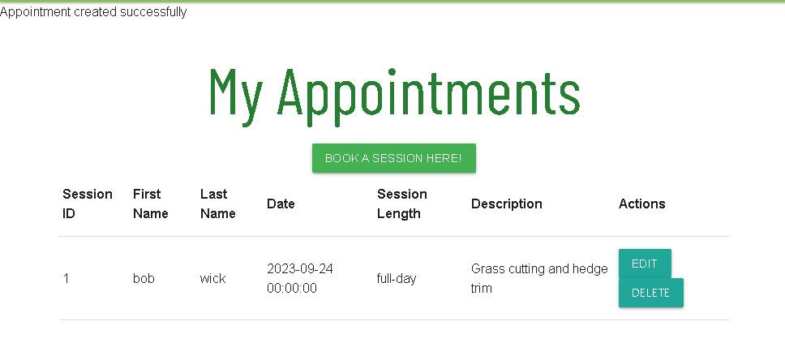 |
| As a returning site user, I would like to ____________, so that I can ____________. | 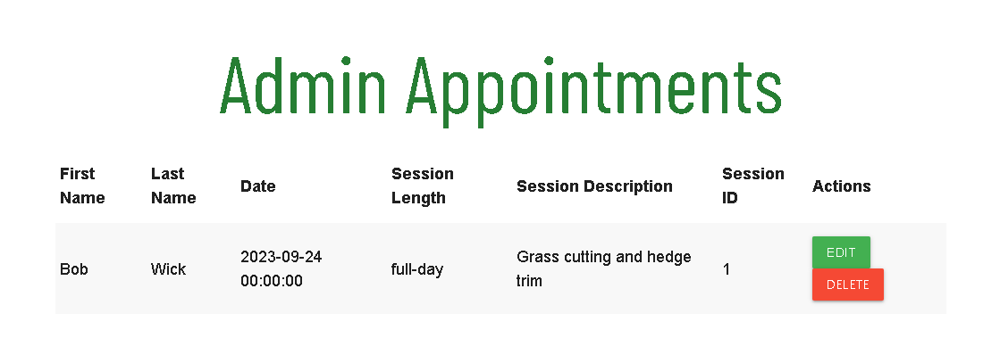 |
| As a returning site user, I would like to ____________, so that I can ____________. | 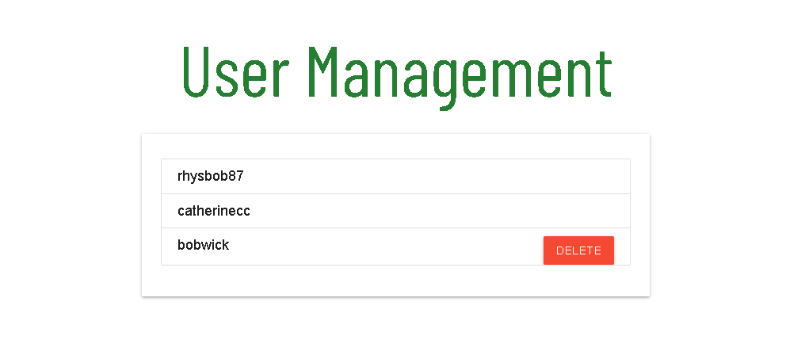 |
| As a site administrator, I should be able to ____________, so that I can ____________. | 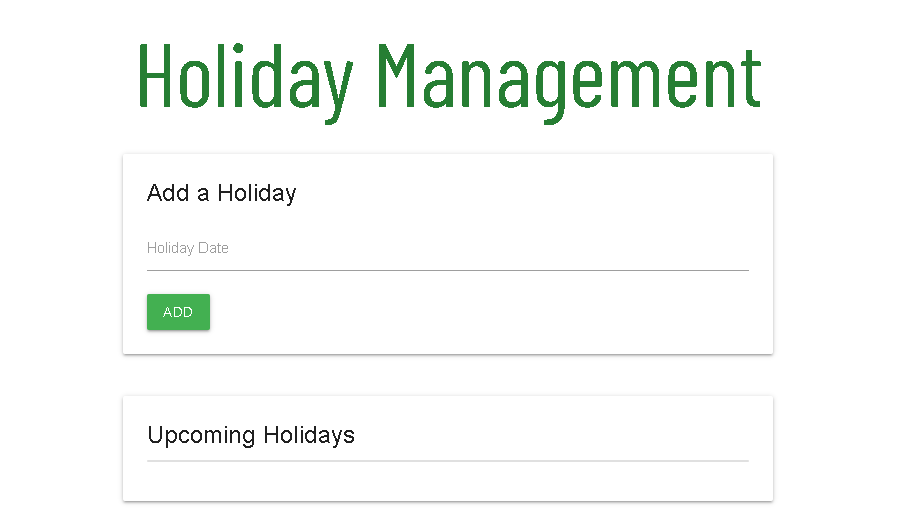 |
| As a site administrator, I should be able to ____________, so that I can ____________. |  |
| As a site administrator, I should be able to ____________, so that I can ____________. |  |
| repeat for all remaining user stories | x |

## Bugs

⚠️⚠️⚠️⚠️⚠️ START OF NOTES (to be deleted) ⚠️⚠️⚠️⚠️⚠️

If you legitimately cannot find any unfixed bugs or warnings, then use the following sentence:

🛑🛑🛑🛑🛑 END OF NOTES (to be deleted) 🛑🛑🛑🛑🛑

There are no remaining bugs that I am aware of.