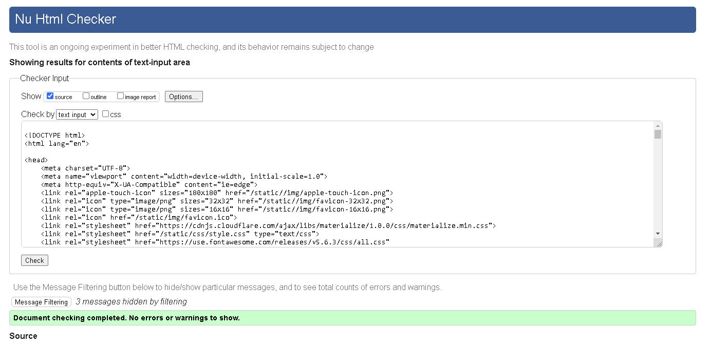
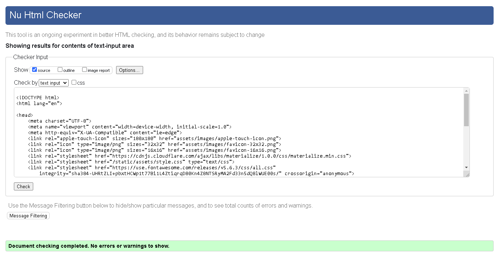
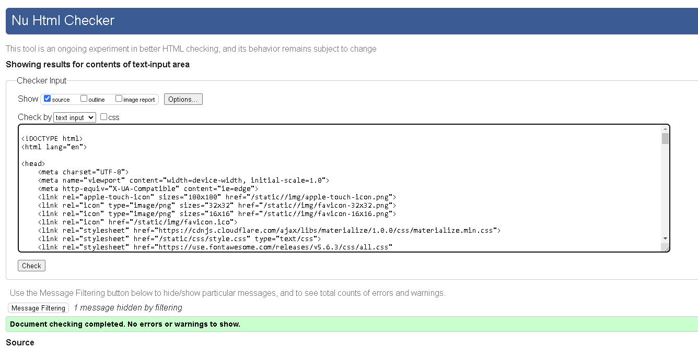
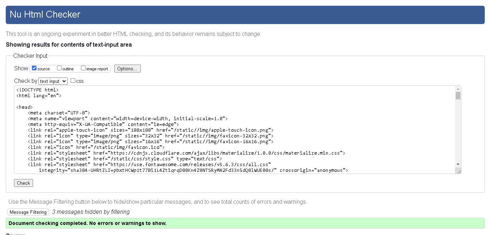
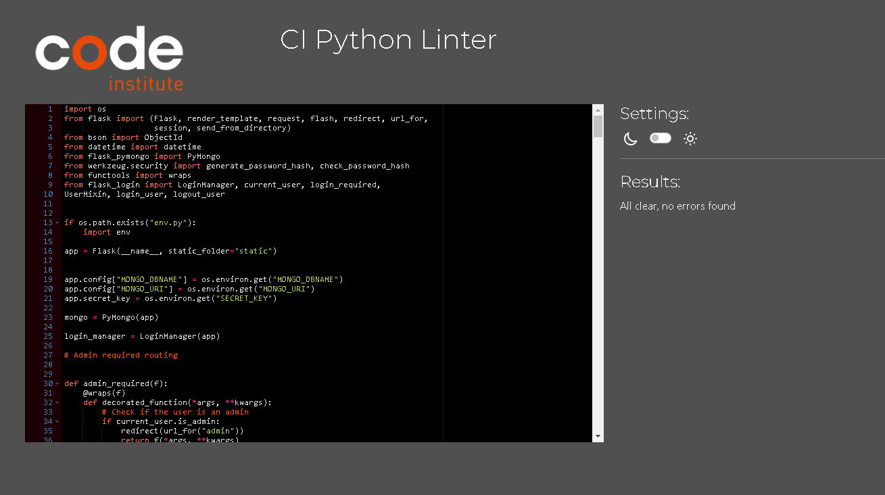
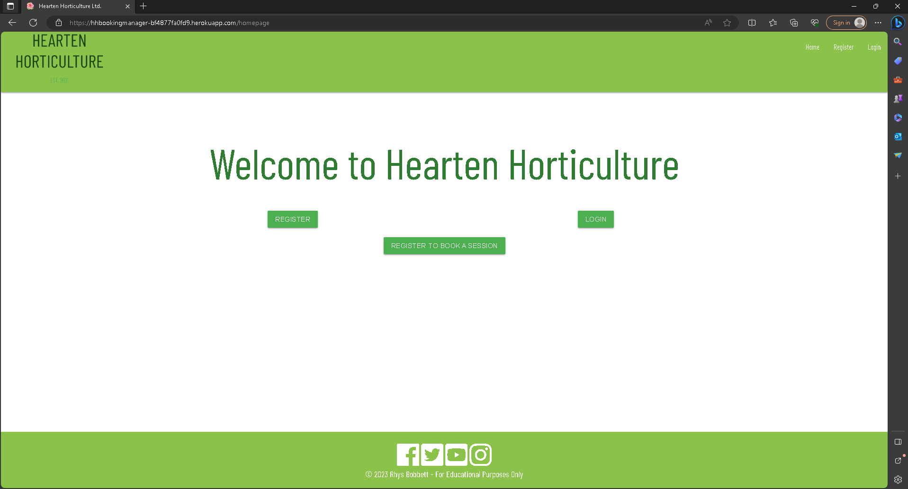
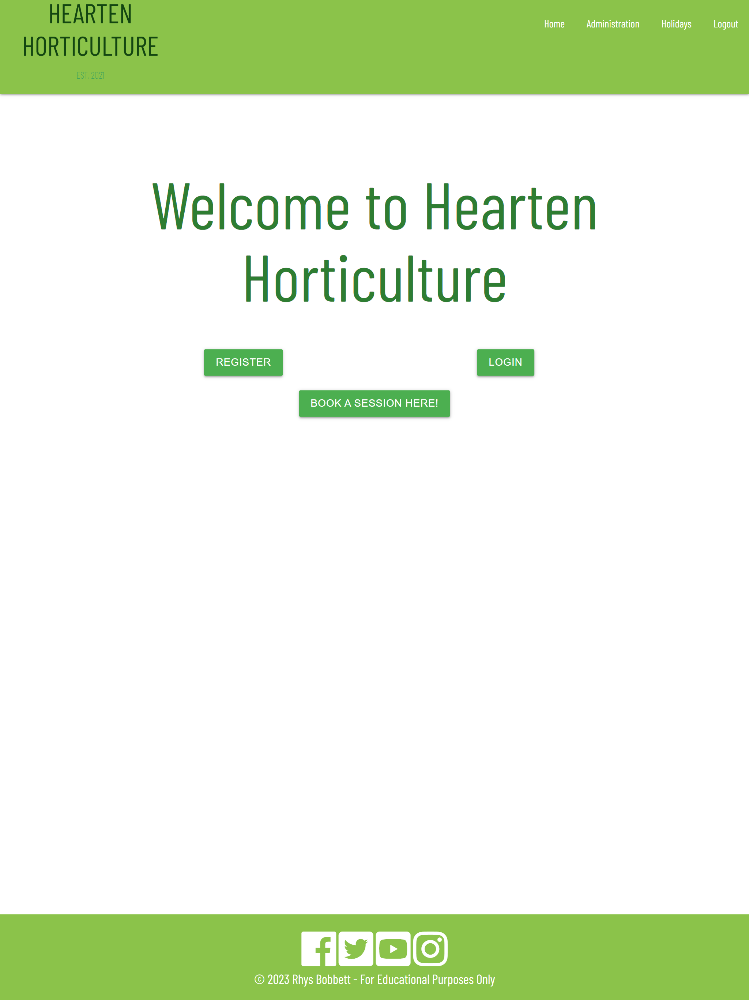
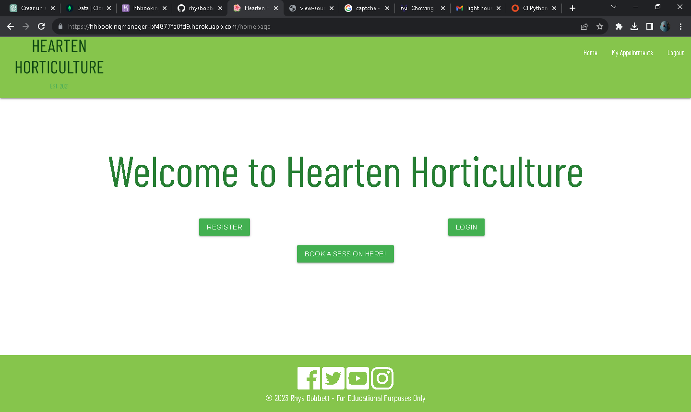
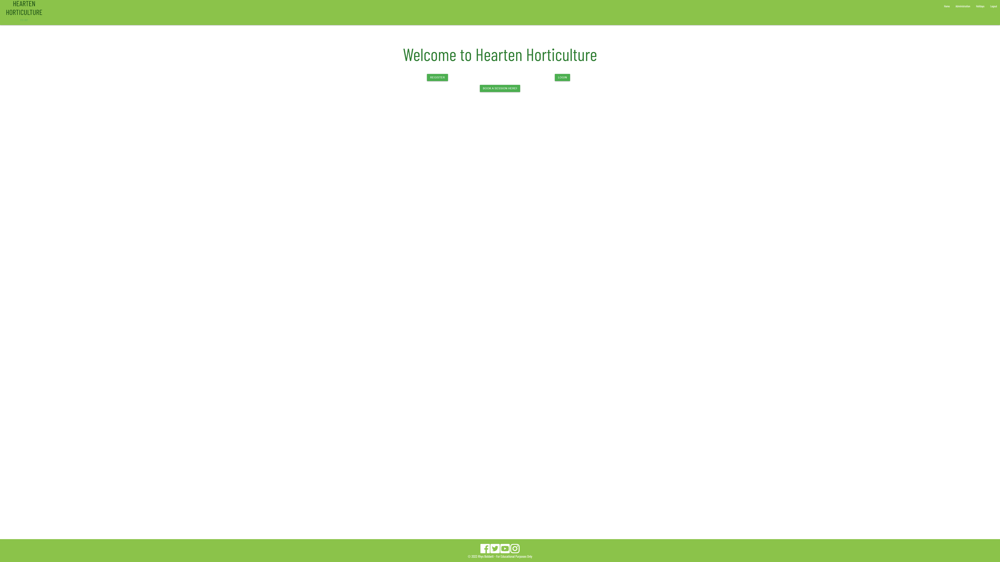

# Testing

Return back to the [README.md](README.md) file.

I have carried out testing and have summarised many new features to implement in future versions of this booking system. 
I believe the site works to a minimal viable standard, potentially I would like to utilise it in a real world scenario for a business to test it further.
I discovered not all features work as intended, but are viable for basic use in demonstrating the read write functionality of the site. MongoDB makes it easily scalable.
Users will be able achieve minimal functionality with the site, but it would be helpful in a real-world scenario.

## Code Validation

I have validated all html pages and code in the repository, the results are seen below.
The W3 validator gave me some error messages such as unopen or unclosed tags, which I can firmly establish are caused by my Flask setup and block structures on the html pages.
I had an aria-label misuse error for a sidenav that I believe relates to the use of Materialize for my base page's layout.

### HTML

I have used the recommended [HTML W3C Validator](https://validator.w3.org) to validate all of my HTML files.

| Page | W3C URL | Screenshot | Notes |
| --- | --- | --- | --- |
| base.html | [W3C](https://validator.w3.org/nu/?doc=https%3A%2F%2Fhhbookingmanager-bf4877fa0fd9.herokuapp.com%2F) |  |  |
| admin.html | [W3C](https://validator.w3.org) |  |  |
| my_appointments.html | [W3C](https://validator.w3.org) |  |  |
| error404.html | [W3C](https://validator.w3.org) |  |  |
| holidays.html | [W3C](https://validator.w3.org) |  |  |
| homepage.html | [W3C](https://validator.w3.org) |  |  |
| login.html | [W3C](https://validator.w3.org) |  |  |
| register.html | [W3C](https://validator.w3.org) |  |  |

### CSS

I have used the recommended [CSS Jigsaw Validator](https://jigsaw.w3.org/css-validator) to validate all of my CSS files.

- https://jigsaw.w3.org/css-validator/validator?uri=https%3A%2F%2Fhhbookingmanager-bf4877fa0fd9.herokuapp.com%2F&profile=css3svg&usermedium=all&warning=1&vextwarning=&lang=en#errors

| File | Jigsaw URL | Screenshot | Notes |
| --- | --- | --- | --- |
| style.css | [Jigsaw](https://jigsaw.w3.org/css-validator/validator?uri=https%3A%2F%2Fhhbookingmanager-bf4877fa0fd9.herokuapp.com%2F&profile=css3svg&usermedium=all&warning=1&vextwarning=&lang=en#errors) |  | Pass: 1 error due to Materialize Framework, not a serious issue to be considered |

### Python

I have used the recommended [PEP8 CI Python Linter](https://pep8ci.herokuapp.com) to validate all of my Python files.

| File | CI URL | Screenshot | Notes |
| --- | --- | --- | --- |
| run.py | [PEP8 CI](https://pep8ci.herokuapp.com/https://raw.githubusercontent.com/rhysbobbett/hhbookingmanager/main/app.py) |  | no errors |
| run.py | |  | no errors |

## Browser Compatibility

I've tested my deployed project on multiple browsers to check for compatibility issues.

| Browser | Screenshot | Notes |
| --- | --- | --- |
| Chrome |  | Works as expected |
| Firefox |  | Works as expected |
| Bing |  | Works as expected |

## Responsiveness
I've tested my deployed project on multiple devices to check for responsiveness issues.

| Device | Screenshot | Notes |
| --- | --- | --- |
| Galaxy Note 3 (DevTools) |  | Works as expected |
| iPad Pro (DevTools) |  | Works as expected |
| Desktop (HP Monitor) |  | Works as expected |
| iPhone 12 |  | Works as expected |
| Samsung 4K TV |  | Works as expected |

## Lighthouse Audit

I've tested my deployed project using the Lighthouse Audit tool to check for any major issues.

| Page | Size | Screenshot | Notes |
| --- | --- | --- | --- |
| Base.html | Mobile |  ||
| Base.html | Desktop |  | |
| homepage.html | Mobile |  ||
| homepage.html | Desktop |  ||
| admin.html | Mobile |  | |
| admin.html | Desktop |  ||
| my_appointments.html | Mobile |  | |
| my_appointments.html | Desktop |  ||
| bookappointment.html | Mobile |  | |
| bookappointment.html | Desktop |  ||

## Defensive Programming

Forms:
- Users cannot submit to an empty form in appointments
- Passwords must contain capital letters and at least 1 special character.

Flask:
- Users cannot brute-force a URL to navigate to a restricted page such as admin.html.
- Users cannot perform CRUD functionality while logged-out
- User-A should not be able to manipulate data belonging to User-B, or vice versa
- Non-Authenticated users should not be able to access pages that require authentication
- Standard users should not be able to access pages intended for superusers.
All stated criteria has been met for Flask defensive programming. A captcha would be useful
in preventing multiple signing up and scripting against the website, a potential for a ddos style attack.

## User Story Testing

| User Story | Screenshot | Notes |
| --- | --- | --- |
| As a new site user, I would like to immediately be aware I'm at the right website and book my appointment for a gardening maintenance session |  | The landing page has a welcome span with buttons for direct access to the main features of the site. |
| As a new site user, I want simplicity and to use straight forward navigation, so that I can access what I require quickly. |  | The nav is clear and adapts depending on user or admin, the navbar collapses on mobile with the same links available.
| As a new site user, I would like to book sessions easily. |  |
| As a returning site user, I would like to book appointments without filling out forms, so that I can speed up the process. |  | The user's first name and last name are automatically populated into booking forms.
| As a site administrator, I should be able to manage any user session, should I get a cancellation by other means of communication so that I can consistently track all appointments on one screen. |  | Admins can see all sessions booked on the platform, and have control over rescheduling and deletion.
| As a site administrator, I should be able to manage user accounts, so that I can delete clients from my records. |  | The admin can delete users, but is unable to delete other admins from the administration page
| As a site administrator, I should be able to manage administrator holidays, so that I can manage annual leave for employees, preventing users from booking sessions on those days. |  | 

## Bugs

Issue: The function to control holiday and user booking clashes failed to work correctly and will need to be investigated further. 
Solution: My code for this function needs to be investigated further. I also wrote code to prevent more than 2 half day sessions being booked on a given date which has failed to function.

Issue: Deployment due to additional queries in the mongodb form prevented the flask app from reading user data correctly.
Solution: This was fixed by removing the bad query document from the mongodb collection.

Issue: The flask routing for "bookappointments" and another flask routing for "manage_sessions" have similar code but function in slightly different ways as one has admin authority and performs checks while the other doesn't.
Solution: This is one of the key points of the site and removing one or the other has caused more problems than good at this point in time, I have decided to keep this code seperate for now as it controls so much functionality of the booking appointments procedures until I can figure out where I've made a logic error. It can be made more concise in the future when other features require implementation.

Issue: Early on in the project I had issues connecting to the mongodb database as I had made a typo in the URI.
Solution: This was a simple fix once it was found but caused a few delays in getting the database up and running.

There are no remaining bugs that I am aware of.